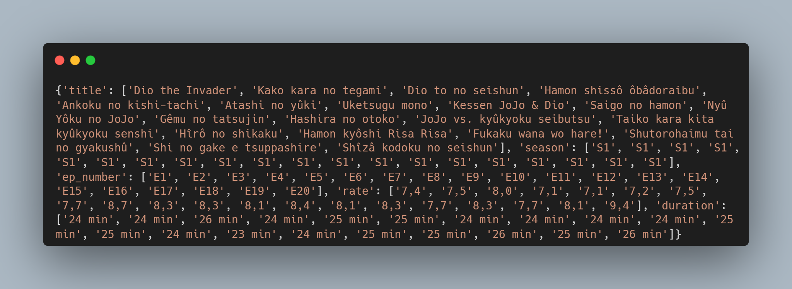

# Episódios de JoJo

A ideia foi criar um script em Python que vá até o site do [IMDb](https://www.imdb.com/), recuperar informações de todos os episódios de JoJo Bizarre's Adventures, exportá-los em um dataset e fazer uma análise de dados com ele. 

### Webscraping

Obteu-se a seguinte amostra de dados com o webscraping

Seguiu-se as seguintes regras de negócio

`7,4 should be 7.4` a representação de números decimais deve ser com ponto e não com vírgula

`25 min should be 25.0` o tempo de duração de episódios deve ser do tipo *float*

`S1 and E2 should be 1 and 2` os episódios e as seasons deverão ser do tipo *int*

### Análise de dados

A análise descritiva dos dados coletados pode ser vista em [JoJo Data Analysis](https://github.com/raphaelramosds/jojo-anime/blob/main/JoJo%20Episodes%20Analysis.ipynb)
